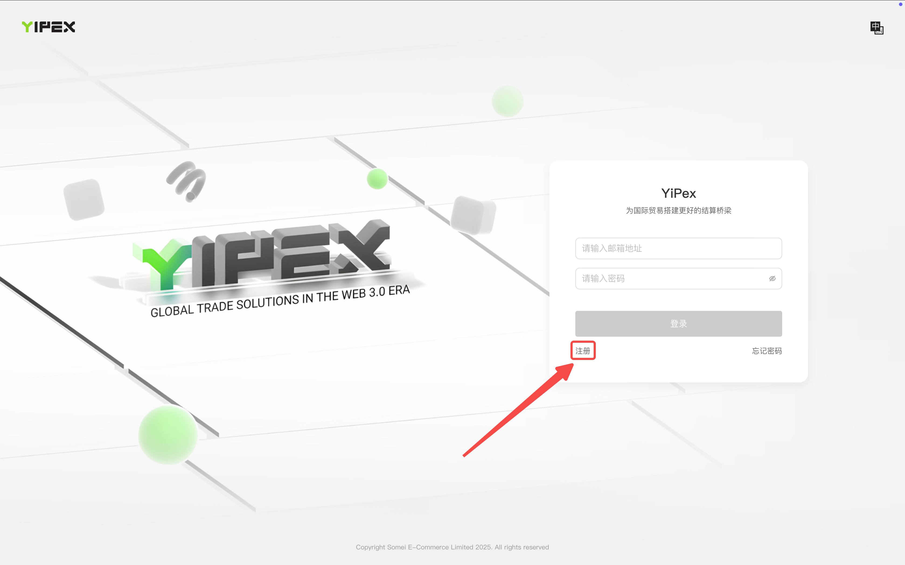

# 注册

## 一、自行注册

点击[YiPex 企业外贸钱包](https://app.yipex.tech/merchant/#/login) 打开以下页面，点击注册

<figure><figcaption></figcaption></figure>

打开以下弹窗后输入注册邮箱并勾选同意《服务条款》和《隐私政策》，为了防止恶意注册，系统有可能会要求您输入图形验证码，完成后点击“立即注册”按钮，YiPex将会发送一条确认注册的邮件至注册邮箱，请仔细检查邮箱，有概率会被系统判定为垃圾邮件。

<figure><figcaption></figcaption></figure>

按照邮箱指引设置登录密码之后，即完成了YiPex账号注册。

## 二、由 YiPex 运营人员代为注册

可以通过线下方式提交企业注册的材料，包括但不限于以下内容及后续登录需要的邮箱。

<figure><figcaption></figcaption></figure>

运营人员完成注册之后YiPex会向登录邮箱发送邮件通知注册完成，请仔细检查邮箱，有概率会被系统判定为垃圾邮件。

该邮件中包含登录地址及登录密码，**为了保证您的资金安全，首次登录后请务必修改默认密码**。

通过该方式注册时，YiPex 运营将完成企业信息认证，注册完成后无需再提交企业认证信息。


<mark style="color:orange;">**YiPex仅为非中国大陆主体、非美国主体提供国家贸易资金交易系统服务，指引中的截图仅为YiPex测试环境数据和功能，实际情况请以实际产品为准。**</mark>

